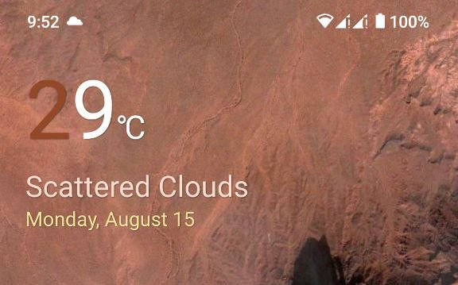
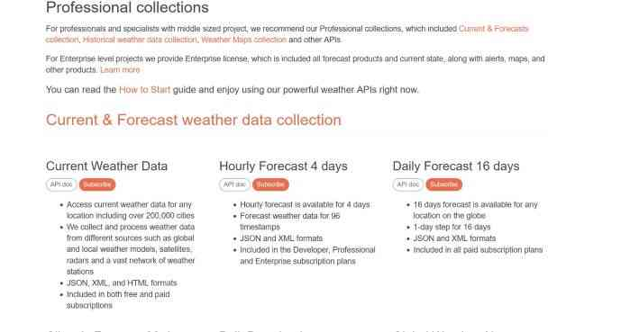
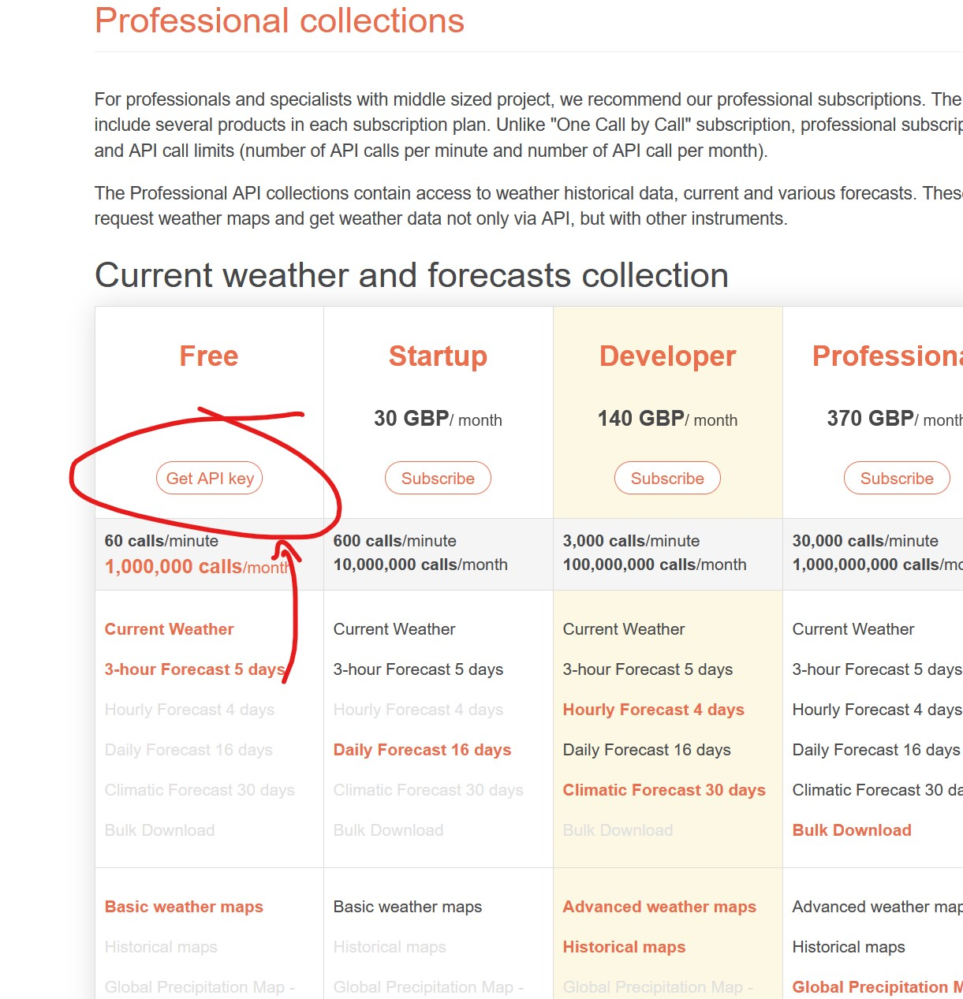

# OnePlus Weather Widget

An attempt to clone OnePlus's Classic Weather Widget with android 12 theme support. It uses OpenWeatherMap's API to get weather data.



## Instructions:
Before installing read these instructions:

 * Allow location access at all times and add the Weather Widget to your home screen, else the weather will not update and "Loading..." will continue to appear.
 


 After allowing location access, it will take some time to load when booted for the first time. Be patient.


**If any issue prevails, Please send me the logs.**

## Build:
In order to test and build the widget on your own, you will require an API key from [OpenWeatherMap](https://openweathermap.org/api).




<br>
After obtaining API key,  After obtaining API key, if building locally, put your API key in environment variable as:
```
    API_KEY : "YOUR_API_KEY"
```
If you are using github actions, Go to:

Fork's settings > Secrets > Actions > Click on New repository secert > under Name put `API_KEY` > under Secret `YOUR_API_KEY` > then click Add Secret

You are ready to use github actions to compile your android app.
